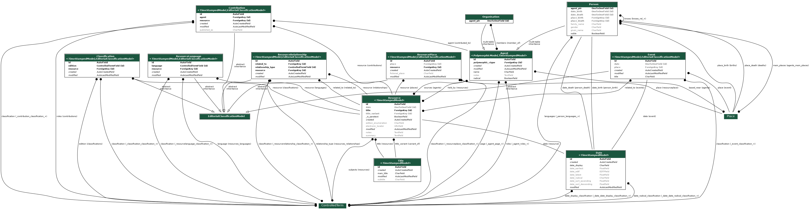

Data Model
==========

The Radical Translations project data model is based on BIBFRAME_, for
Resources (Works, Instances, Items) and Events, and based on FOAF_ for
Agents (Persons, Organisations).

    Django models

.. _BIBFRAME: https://www.loc.gov/bibframe/docs/bibframe2-model.html
.. _FOAF: http://xmlns.com/foaf/spec/

ParatextualFeature (Contribution in BIBFRAME)::

    type: preface|dedication|notes|appendix|epigraph|...
    authors: ParatextualFeatureAuthor
    quote: text
    original_label: text (if different of type)
    editorital_notes: text

ParatextualFeatureAuthor::

    pf: ParatextualFeature
    author: person
    role: author|editor|translator
