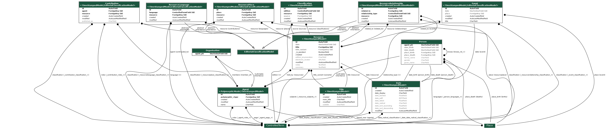
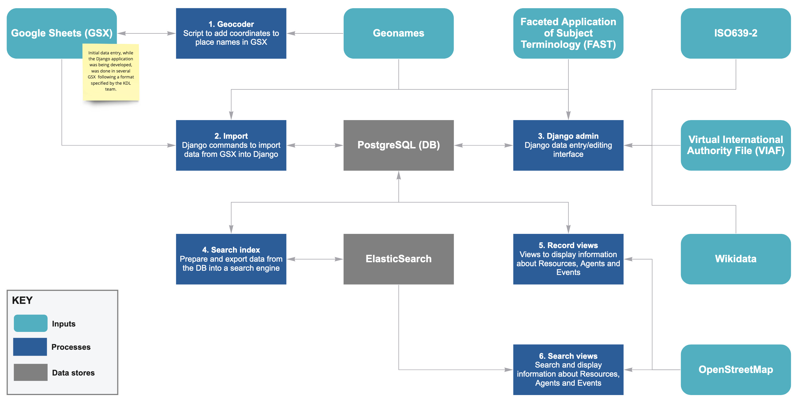
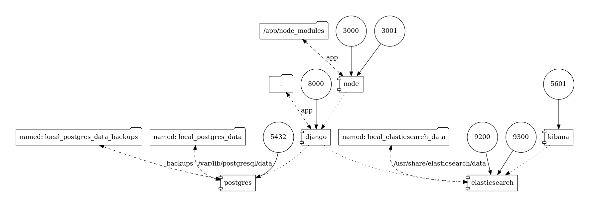
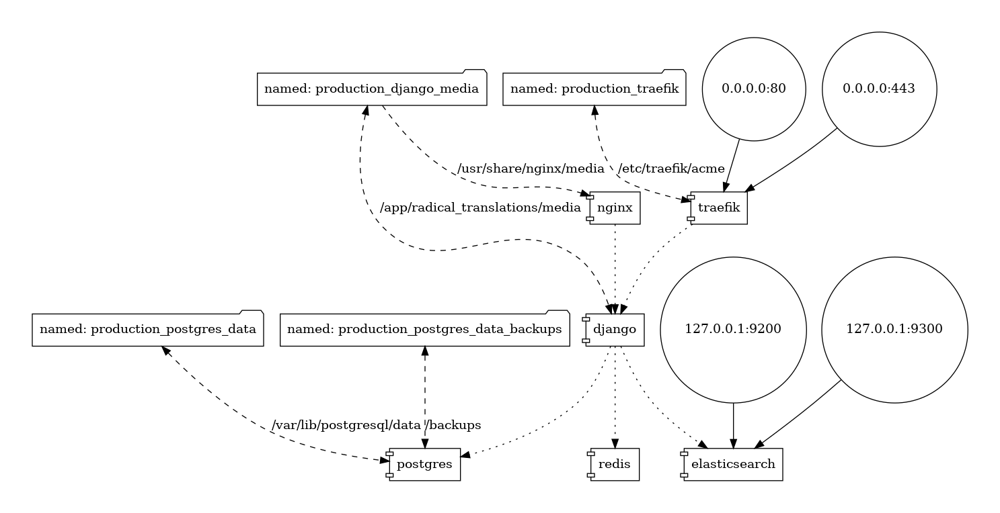
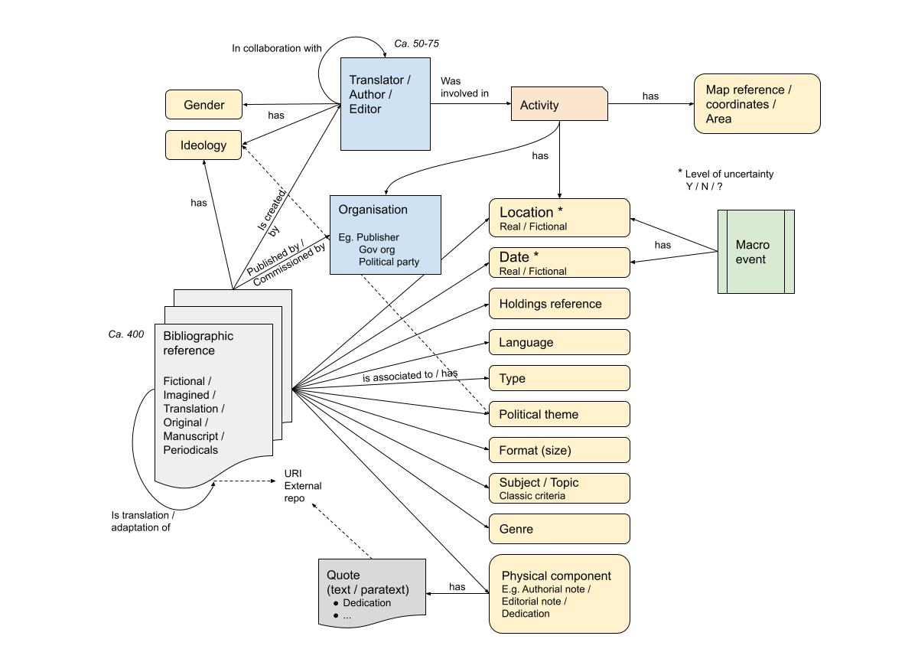
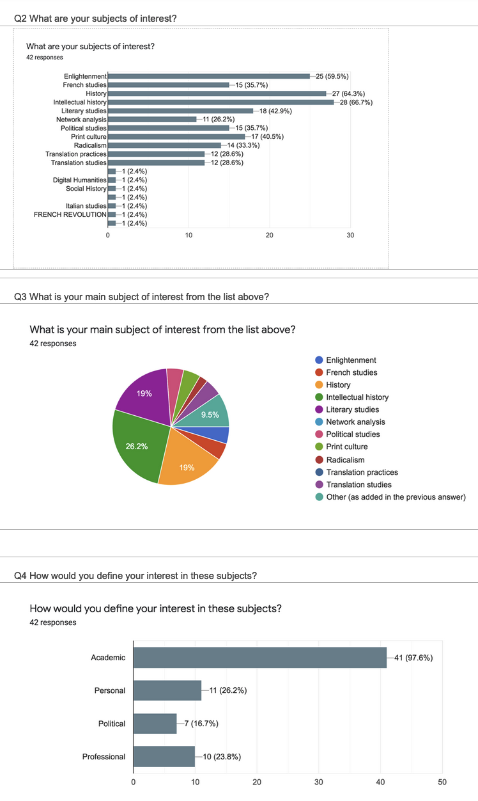
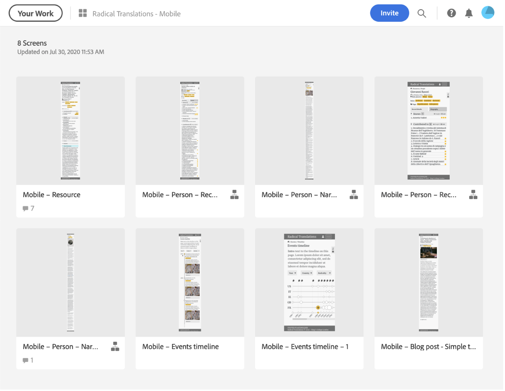
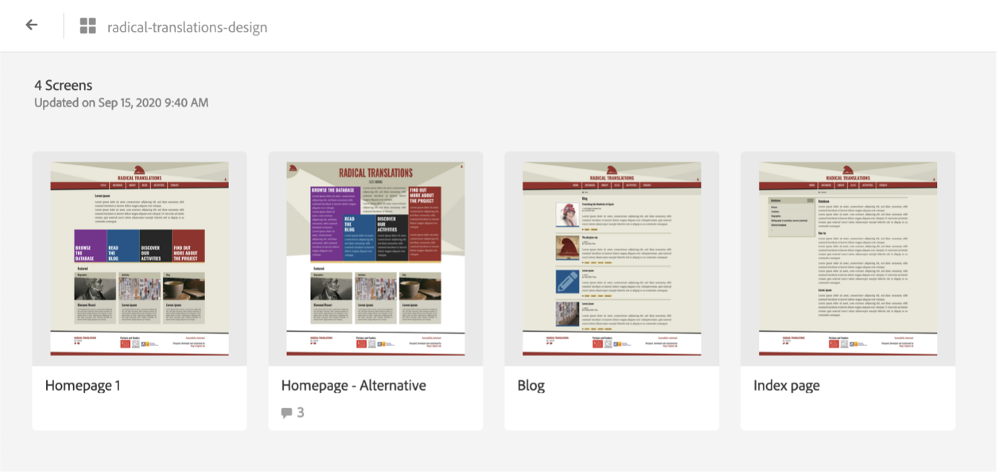
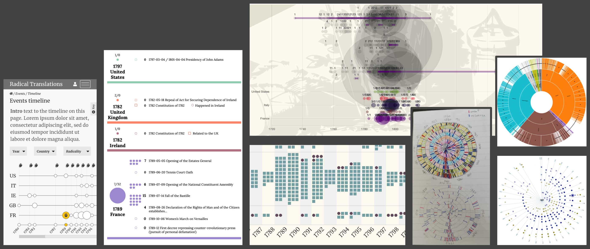

.. _technical-overview:
.. highlight:: bash

Technical Overview
==================

Team
----

.. literalinclude:: ../radical_translations/static/humans.txt
    :language: text
    :start-after: */
    :end-before: /*

Technologies and Processes
--------------------------

Development
^^^^^^^^^^^

For more information see `development`_ and `development with docker`_.

.. _development: https://cookiecutter-django-kingsdigitallab.readthedocs.io/en/latest/developing-locally.html
.. _development with docker: https://cookiecutter-django-kingsdigitallab.readthedocs.io/en/latest/developing-locally-docker.html

Data model
^^^^^^^^^^

The Radical Translations project data model is based on
BIBFRAME_, for Resources (Works, Instances, Items are flattened under one
object type) and Events, and based on FOAF_ for Agents (Persons, Organisations). 

    Django models

The data model graph was generated with the `django-extensions graph_models`_
command::

    $ fab django "graph_models -X TimeStampedModel,PolymorphicModel -o models.png agents core events utils"

The following table shows the names of the fields in the data model and how they are
being labelled for the search and detail views.

.. csv-table:: Data model fields concordance
    :file: _static/concordance.csv
    :header-rows: 1
    :stub-columns: 1

Conceptual model frameworks:
~~~~~~~~~~~~~~~~~~~~~~~~~~~~

* BIBFRAME_ to model objects and relationships for bibliographic resources
  (the instances for paratexts are resources labelled as paratexts and
  `part_of` other resources)
* BIBFRAME_ uses FOAF_ for its Agent_ class to model relationships between 
  agents, persons, organisations and other objects. 

Controlled terms
~~~~~~~~~~~~~~~~

The vocabularies, data points and taxonomies, used by Radical
Translations data model:

* FAST_ used for genres (subjects):  this is part of the Library of Congress
  Linked Open Data resources mapped as FAST topics/forms
* Additional terms for subjects (with respect to types of publications and
  genres) use terms from the RBMS controlled vocabularies (in particular
  the `RBMS printing and publishing`_ and `RBMS genre` vocabularies)
* Wikidata_ for the professions (roles) of persons e.g. authors and
  translators as well as types of organisations e.g. political parties
  vs publishers; Wikidata terms are also used to express editorial
  classification e.g. of dates (e.g. inferred), events (typology) and
  relationships (e.g. uncertain attribution)
* VIAF_ to identify some of the agents (persons) who are well known
  translators/authors
* `ISO code for languages`_
* GeoNames_ for geocoded placenames
* Extended Date/Time Format (EDTF_) Specification to express dates
* In one case controlled terms are based on project-specific terms; this is
  the case for ‘classification scheme edition’ for the Resources objects
  (in particular paratexts) with values partially adapted from
  Kathryn Batchelor, Translation and Paratexts (Roudledge 2018);
  Amy Nottingham-Martin,"Thresholds of Transmedia Storytelling" in
  Examining Paratextual Theory and Its Applications in Digital Culture,
  ed. Nadine Desrochers and Daniel Apollon, (IGI Global 2014), 287-307.

.. _BIBFRAME: https://www.loc.gov/bibframe/docs/bibframe2-model.html
.. _FOAF: http://xmlns.com/foaf/spec/
.. _Agent: http://xmlns.com/foaf/spec/#term_Agent
.. _FAST: https://www.oclc.org/research/themes/data-science/fast.html
.. _RBMS printing and publishing: http://rbms.info/vocabularies/printing-publishing/alphabetical_list.htm
.. _RBMS genre: https://rbms.info/vocabularies/genre/alphabetical_list.htm
.. _Wikidata: https://www.wikidata.org/wiki/Wikidata:Main_Page
.. _VIAF: https://www.oclc.org/en/viaf.html
.. _ISO code for languages: http://id.loc.gov/vocabulary/iso639-2.html
.. _Geonames: http://www.geonames.org/ 
.. _EDTF: https://www.loc.gov/standards/datetime/
.. _django-extensions graph_models: https://django-extensions.readthedocs.io/en/latest/graph_models.html

Workflows
^^^^^^^^^

    Data workflow

Architecture
^^^^^^^^^^^^

    Local Docker Stack

    Production Docker Stack

The graphs were generated by the docker-compose-viz_ tool::

    $ docker run --rm -it --name dcv -v $(pwd):/input pmsipilot/docker-compose-viz render -m image local.yml

.. _docker-compose-viz: https://github.com/pmsipilot/docker-compose-viz

Design process
--------------

The design process followed to develop and deliver the Radical Translations project is derived from the `double diamond process`_.

It consists of four phases with often multiple iterations happening within each phase.

.. _double diamond process: https://www.designcouncil.org.uk/our-work/skills-learning/the-double-diamond/

Phase 1 – Discover
^^^^^^^^^^^^^^^^^^
During this phase we discussed the project details and objectives with the research team. Understanding the data, contributing to the definition of the data model, defining and surveying potential audiences. Design workshops were also held to explore options and expectations at different points in the project and plan further design iterations.

Phase 2 – Define
^^^^^^^^^^^^^^^^
The outcomes (e.g., reports) were aligned with the project requirements and tasks to start development were created (iteratively, following increments).

Phase 3 – Develop
^^^^^^^^^^^^^^^^^
Different solutions were offered (e.g., static and interactive mock-ups) to realise the vision of the project, component by component.

Phase 4 – Deploy
^^^^^^^^^^^^^^^^
Usability testing and final implementation took place. Further adjustments happened in this phase to accommodate reactions from the wider audience interacting with the digital platform.

Design Workshops and User Research
^^^^^^^^^^^^^^^^^^^^^^^^^^^^^^^^^^
**Purpose:** align high level requirements to use cases to drive data model definition and development (use cases lead to identification of usability testing units later in the evolutionary development cycle).

Mapping the data 
~~~~~~~~~~~~~~~~

    *Draft domain model*

User types, scenarios and cases
~~~~~~~~~~~~~~~~~~~~~~~~~~~~~~~

Identify audiences and user types: anonymous survey sent to identified groups of interest and data collected over a 1-month period.

A report of the survey outcome was shared within the team.

    *A screenshot of the survey partial results*

KDL and the research team collaboratively defined use cases and user scenarios.

The scenarios mainly focused on the search and retrieval of information in the search and browse section of the site (database_).

.. _database: https://radicaltranslations.org/database/

Research
~~~~~~~~
At this point KDL started work on the look and feel. Iconographic research, colour palette and imagery were collected to study and drive the creation of a design style that matched and reinforced the message and information the content is conveying. 

Mock-ups
^^^^^^^^

Next rounds of mock-ups were created. Following the `mobile first approach`_, the focus was on prioritising content and interaction, rather than style.

    *First round of mock-ups*

**Content guidelines** were also provided to support the research team generate accessible, and web suitable, content.

Adjustments were made based on comments and feedback.

    *Second round of mock-ups*

The same approach was applied to specific components of the site, like the search and timeline visualisation.

    *Design iterations over the timeline component*

More information on the process to create the timeline visualisation is available 

.. _mobile first approach: https://xd.adobe.com/ideas/process/ui-design/what-is-mobile-first-design/

Qualitative usability testing
^^^^^^^^^^^^^^^^^^^^^^^^^^^^^
Usability testing focused on the Database section of the site.

A set of tasks was created to test specific areas of the digital platform:

1. Top navigation
#. Secondary navigation
#. Search and Browse (Agents and Resources)
#. Timeline (Interactive visualisation)

Five testers were selected and interviews took place both in person and remotely.
Findings where then shared with the team and further improvements were implemented based on the testing outcomes.