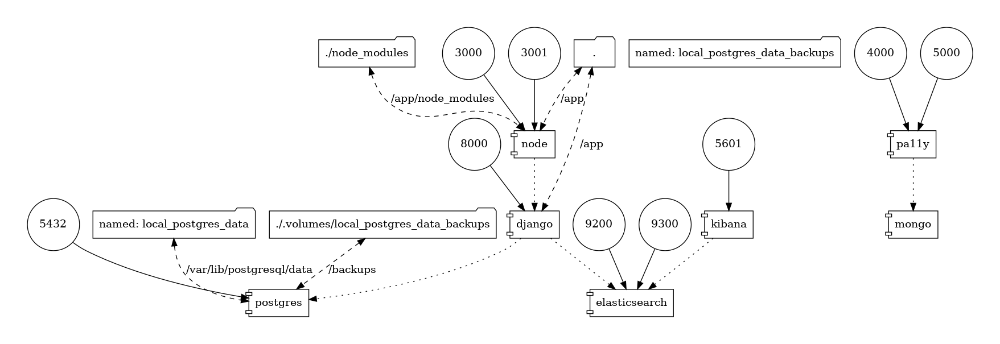

.. _technical-overview:
.. highlight:: bash

Technical Overview
==================

Team
----

.. literalinclude:: ../radical_translations/static/humans.txt
    :language: text
    :start-after: /* TEAM */
    :end-before: /* SITE */

Technologies and Processes
--------------------------

Development
^^^^^^^^^^^

For more information see `development`_ and `development with docker`_.

.. _development: https://cookiecutter-django-kingsdigitallab.readthedocs.io/en/latest/developing-locally.html
.. _development with docker: https://cookiecutter-django-kingsdigitallab.readthedocs.io/en/latest/developing-locally-docker.html

Data model
^^^^^^^^^^

The Radical Translations project data model is based on BIBFRAME_, for
Resources (Works, Instances, Items) and Events, and based on FOAF_ for
Agents (Persons, Organisations).

.. figure:: _images/models.png
    :align: center
    :alt: Django models
    :figclass: align-center
    :width: 100%

    Django models

The data model graph was generated with the `django-extensions graph_models`_
command::

    $ ./bake.py manage graph_models -X TimeStampedModel,PolymorphicModel -o models.png agents core events utils

.. _BIBFRAME: https://www.loc.gov/bibframe/docs/bibframe2-model.html
.. _FOAF: http://xmlns.com/foaf/spec/
.. _django-extensions graph_models: https://django-extensions.readthedocs.io/en/latest/graph_models.html

Workflows
^^^^^^^^^

TODO: data processing & editorial workflows

Architecture
^^^^^^^^^^^^
TODO: Extract high level description from PQ

    Local Docker Stack

    Production Docker Stack

The graphs were generated by the docker-compose-viz_ tool::

    $ docker run --rm -it --name dcv -v $(pwd):/input pmsipilot/docker-compose-viz render -m image local.yml

.. _docker-compose-viz: https://github.com/ahmadawais/Emoji-Log

Design process
--------------

TODO: describe design process
